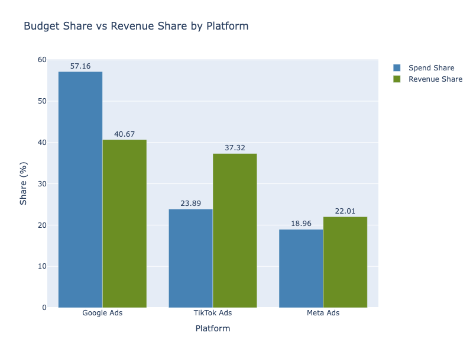
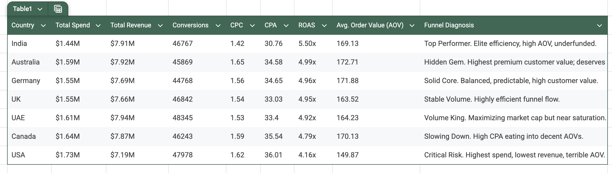
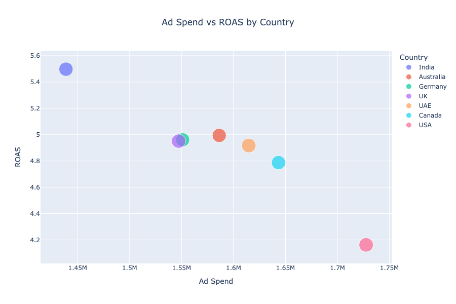
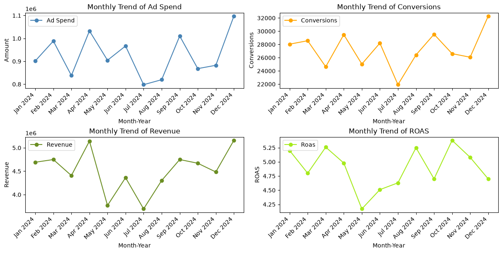

# Where Next Dollar of Advertising Spend should Go

## Current Budget Share is Misaligned with Observed Revenue Efficiency Across Platforms

Google generates the most absolute revenue, but it does so while consuming more than half of the advertising budget.

Google is the largest contributor to revenue, but its share of revenue is substantially lower than its share of advertising spend. Google receives 57.2% of total spend but generates 40.7% of revenue, a 16.5 percentage-point gap.

TikTok shows the opposite pattern: it receives 23.9% of spend while generating 37.3% of revenue, a 13.43 percent-point increase. Meta also generates a larger share of revenue (plus 3.05%) than its share of spend.

This suggests that the current budget mix is not aligned with observed revenue efficiency across platforms and warrants further investigation into whether budget allocation should be adjusted.

## TikTok Search Ads Are the Most Profitable 

| Metric |	Search Campaigns |	Display Campaigns |	Performance Winner |
| :--- | :---: | :---: | :------- |
| ROAS | 8.20x	| 8.01x	| Search (+2.4%) |
| CPA |	20.23 | 21.29 | Search (5% cheaper) |
| CPC |	0.99 | 1.06	| Search (7% cheaper) |
| Conversion Rate (CVR) |	0.0492 | 0.0497	| Display (+1% efficient) |
| CTR |	0.0573 | 0.054 | Search (+6% engaging) |

- Our Search campaigns lead overall performance with an **8.20x ROAS and a $20.23 CPA**. This efficiency is driven on the front end by stronger ad engagement **(5.73% CTR)** and lower traffic costs **($0.99 CPC)**.
- Interestingly, our Display campaigns are remarkably efficient at converting traffic, boasting a slightly higher conversion rate **(4.97% CVR)** than Search. However, because *Display traffic costs slightly more ($1.06 CPC)*, its final **CPA lands at $21.29**, yielding a still-elite **8.01x ROAS**.

**Key Takeaway:** TikTok Search Ads secure a slight edge in profitability **(8.20x ROAS)** thanks to cheaper front-end traffic **($0.99 CPC) and $20.23 customer acquisition cost**. Display’s **exceptional 4.97% higher conversion rate** keeps both channels running at a near-identical, elite tier of profitability.

## Entire Efficiency-to-Volume Analysis

Global marketing efficiency analysis shows that the USA is severely dragging down global performance (highest CPA, 36.01 dollars, but the lowest ROAS 4.16x and AOV	149.87), while India and Australia represent massive missed revenue opportunities due to higher average transaction values and low acquisition friction.

Our current budget allocation is leaving significant profit on the table. India generated virtually identical revenue to the UAE (7.91M vs. 7.94M) despite spending 175,940 less. If we reallocate budget to equalize spending between the two countries, India's 5.50x ROAS dictates we would capture substantially more total revenue and conversions than we currently get from the UAE market.

## Monthly Trends

It appears that December brings in more revenue and conversions but low return on ad spend due to higher spending. October gives us the highest ROAS while March generates the most revenue and better ROAS even though we get only few conversions, suggesting that we acquire high value clients in March at low cost.

